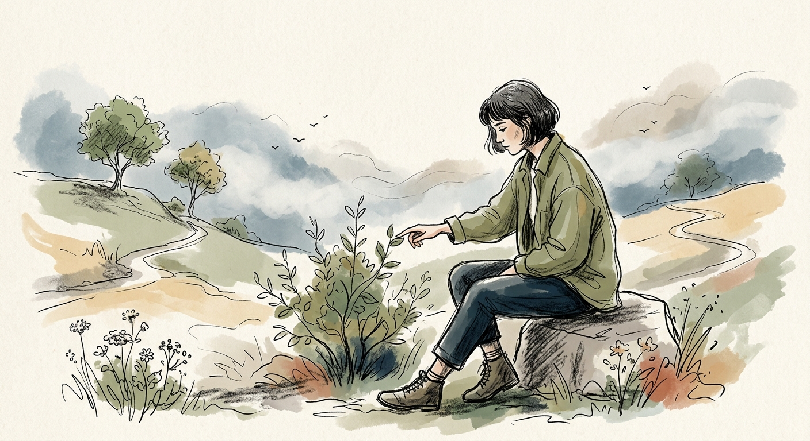

<div align="center">

# Odyssey Skill / 奥德赛.skill



<p>
  每个人都在自己的奥德赛。<br>
  在他人的旅程里，找到你的下一步。
</p>

<p>
  <em>Every life is an odyssey.</em><br>
  <em>Find your next step in stories already lived.</em>
</p>

<p>
  
  
  
  
</p>

<p>
  Odyssey Skill is an installable AI-agent skill for finding real life-decision reference cases and podcast sources from the Odyssey Map case library.
</p>

<p>
  它不替你做决定，也不把人生问题压成建议清单。它会从真实的人生选择故事里，找到与你处境相近的路径、约束、代价和结果，让你在别人的旅程里看见自己的下一步。
</p>

<p>
  Built for Codex, Claude Code, and other Agent Skills-compatible runtimes. The skill searches a published GitHub JSON database, returns real decision stories with source links, and answers with a gentle but evidence-bounded style.
</p>

<p>
  <a href="#效果示例">效果示例</a> ·
  <a href="#install-in-codex">安装</a> ·
  <a href="#data-updates">数据来源</a> ·
  <a href="#what-it-includes">工作原理</a> ·
  <a href="#product-boundary">边界</a>
</p>

</div>

---

## 效果示例

```text
用户  ❯ 我的背景是大厂产品经理，工作四年，现在想裸辞，有什么推荐的播客吗？

奥德赛 ❯ 听起来你不是没想过，而是有几个顾虑卡在一起了。
          我先往“想停下来，但现实压力还在”的方向找几个真实故事。
          我们不急着下结论，先一起看看别人是怎么走过这段的。

          这里有几个可以先看的方向：

          1. 有人从稳定工作里停下来，先处理长期消耗感，再慢慢重建节奏。
          2. 有人没有立刻裸辞，而是把副业、储蓄和时间窗口先拆开算清楚。
          3. 也有人离开大厂后才发现，真正要面对的不是职业选择，而是生活方式选择。

          你想先看哪一种？
```

This is not life advice. It is a search-and-story skill: every recommendation should point back to real source material when available.

## What It Includes

```text
odyssey-skill/
├── SKILL.md
├── agents/openai.yaml
├── scripts/
│   ├── fetch_indexes.py
│   ├── search_odyssey.py
│   └── validate_remote_data.py
└── references/
    ├── data-contract.md
    ├── response-style.md
    └── search-policy.md

data/
├── decision_storylines_v2.json
├── manifest.json
├── odyssey_search_index.json
└── source_index.json
```

- `odyssey-skill/` is the installable Skill folder for Codex and Claude Code.
- `data/` is the cloud database served through GitHub Raw URLs.
- Runtime scripts use only the Python standard library.
- Search indexes are cached locally after first use.
- The installable skill folder does not embed `data/`; first use needs GitHub Raw access unless cache has already been warmed.

## Install In Codex

Install or add the `odyssey-skill/` folder as a Codex skill from this repository.

The skill entrypoint is:

```text
odyssey-skill/SKILL.md
```

Codex UI metadata is included at:

```text
odyssey-skill/agents/openai.yaml
```

After installation, ask Codex a question such as:

```text
Use $odyssey-skill: 我的背景是大厂产品经理，工作四年，现在想裸辞，有什么推荐的播客吗？
```

## Install In Claude Code

Copy or link the inner `odyssey-skill/` folder into your Claude Code skills directory.

Example:

```bash
cp -R odyssey-skill ~/.claude/skills/odyssey-skill
```

Then ask Claude Code a question that matches the skill description, such as:

```text
我的背景是大厂产品经理，工作四年，现在想裸辞，有什么推荐的播客吗？
```

Claude Code can run the bundled search script directly from the installed skill folder:

```bash
python3 scripts/search_odyssey.py "大厂产品经理 工作四年 想裸辞 推荐播客"
```

## Direct Local Usage

From the repository root:

```bash
python3 odyssey-skill/scripts/search_odyssey.py "大厂产品经理 工作四年 想裸辞 推荐播客"
```

On first run, the script downloads `manifest.json`, `odyssey_search_index.json`, and `source_index.json` from:

```text
https://raw.githubusercontent.com/yaosiyuuu6/odyssey-skill/main
```

Warm the local cache after installation:

```bash
python3 odyssey-skill/scripts/fetch_indexes.py
```

The default cache directory is:

```text
~/.cache/odyssey-skill
```

If your environment cannot write to `~/.cache`, set a writable cache path:

```bash
ODYSSEY_SKILL_CACHE_DIR=/tmp/odyssey-skill-cache \
python3 odyssey-skill/scripts/search_odyssey.py "我想裸辞，有什么播客可以参考？"
```

## Configuration

Optional environment variables:

```bash
ODYSSEY_SKILL_REMOTE_BASE_URL=https://raw.githubusercontent.com/yaosiyuuu6/odyssey-skill/main
ODYSSEY_SKILL_CACHE_DIR=~/.cache/odyssey-skill
ODYSSEY_SKILL_CACHE_TTL_SECONDS=86400
```

Use `ODYSSEY_SKILL_REMOTE_BASE_URL` if you fork this repository or host the JSON data elsewhere.

To verify a custom remote:

```bash
python3 odyssey-skill/scripts/fetch_indexes.py \
  --remote-base-url "$ODYSSEY_SKILL_REMOTE_BASE_URL"
```

## Data Updates

The source database lives in:

```text
data/decision_storylines_v2.json
```

After editing the source database, rebuild indexes:

```bash
python3 odyssey-skill/scripts/build_indexes.py \
  --source data/decision_storylines_v2.json \
  --out-dir data
```

Then validate the published data contract:

```bash
python3 odyssey-skill/scripts/validate_remote_data.py --data-dir data
```

## Validation

Run the test suite:

```bash
python3 -m pytest tests -q
```

Validate the skill package shape:

```bash
python3 ~/.codex/skills/.system/skill-creator/scripts/quick_validate.py odyssey-skill
```

Expected results:

- tests pass
- data validation passes
- skill validation reports `Skill is valid!`

## Failure Behavior

If GitHub Raw is unavailable but local cache exists, the skill uses cached data and mentions that briefly.

If GitHub Raw is unavailable and no cache exists, the skill does not invent recommendations. User-facing search stays brief, while `fetch_indexes.py` prints diagnostic details for setup:

```text
远程 GitHub 数据暂时不可用，且本地还没有可用缓存。
remote_base_url=...
cache_dir=...
```

## Product Boundary

Odyssey Skill provides real decision references, not life advice.

It should recommend real cases and podcast sources, explain similarities and differences through natural story paragraphs, and preserve uncertainty. It should not say what the user should choose.
